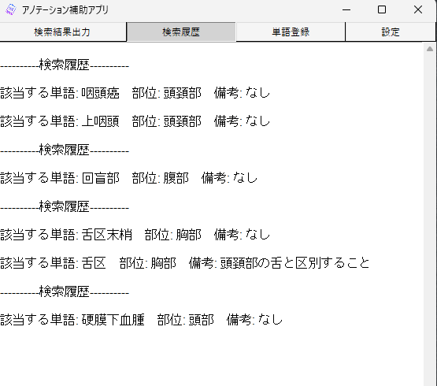

## 文章データのアノテーションを補助するWindowsアプリ

excel等で文章データをアノテーションする際、わからない単語のクラスを`Ctrl + C`で辞書検索できるWindowsアプリです。

### 基本機能

1. 文章中にあるわからない単語のクラスを`Ctrl + C`で辞書検索する機能

2. アプリを開いてから検索した単語の履歴を表示する機能

3. 辞書に存在しない単語を追加する機能

4. アプリの設定を変更する機能＆辞書を更新する機能

## 1. 文章中にあるわからない単語のクラスを`Ctrl + C`で辞書検索する機能

辞書検索するとメインウィンドウに出力結果が表示されます。検索方法は部分一致検索となっており、表示される順番は辞書に登録されている単語順となっています。また、辞書検索がヒットしなかった場合、`該当する単語は辞書にありませんでした。`と表示されます。

### デモ（GIF）


## 2. アプリを開いてから検索した単語の履歴を表示する機能

履歴は一番最近検索してヒットした単語順になっています。また、アプリを終了すると履歴は自動的に消去されます。



## 3. 辞書に存在しない単語を追加する機能

辞書に登録する際は、単語名とクラス名のチェックを入力しなければ登録できません。


## 4. アプリの設定を変更する機能＆辞書を更新する機能

辞書を更新する機能は、単語名が重複して登録されることもあります。

- 検索時の遅延時間を変更できます（初期設定値：0.1秒）
- メインウィンドウを最前面表示するかを設定できます（初期設定では、最前面表示になっています）
- アプリの辞書をリモート先（GitHub上）から更新します


## 注意点

バグがあるため`Ctrl + C`で辞書検索できない時があります。その際は、アプリの再起動をお願いします。

追記：言語の入力切り替えをするとバグが起きてました。バグの修正はできましたが、まだ`Ctrl + C`で辞書検索できない時はアプリの再起動をお願いします。

## Pythonファイルから実行する際の環境構築手順

1. PC上にAnacondaをインストール

2. [このサイト](https://lozeymn.hatenablog.com/entry/python4)を参考にして、Aconda Promptの作業フォルダをDocumentsに変更後、Anaconda Promptを起動する

3. PCのDocumentsディレクトリ上にregion_dictをclone

    ```
    git clone https://github.com/w034ff/region_dict.git
    ```

4. region_dictディレクトリが作成されるので、cdコマンドでそのディレクトに移動する

    ```
    cd region_dict
    ```

5. 以下のコマンドでAnacondaの仮想環境を作成し、仮想環境内に入る

    ```
    # dict_env.ymlを使用して仮想環境を構築
    conda env create -f dict_env.yml

    # 仮想環境(dict)に入る
    conda activate dict
    ```

6. 以下のコマンドでregion_dict.pyの実行し、辞書検索アプリを起動する

    ```
    python region_dict.py
    ```

7. 以下のコマンドでregion_dict.pyをexeファイルにする

    ```
    pyinstaller --add-data="region_dict.json;." --add-data="settings.ini;." --add-data="icons8-book-96.ico;." --icon=icons8-book-96.ico --noconsole region_dict.py --onefile 
    ```

    - `--onefile`: 実行に必要なファイルを１つにまとめてexeファイルを生成します。その場合、JSONファイル等は直接編集できなくなります。

### 辞書について

辞書の内容は、JSONファイルに格納されています。JSONファイルに複数の単語を一度に追加したい場合は、直接JSONファイルを編集する方法が効率的です。（JSONファイル編集用のプログラムは作成しておりません）

### 更新元の変更について

settings.iniの`[GITHUB_URL]セクションのurl`項目を変更することで、JSONファイルのデータソース（更新元）を変更できます。

## 使用技術

- Python
- Tkinter
- Pyinstaller

## 最後に

Excelで文章のアノテーションを行っていた際に、知らない単語を一つ一つインターネットで調べるのが時間の無駄だと感じ、このアプリを開発しました。しかし、Tkinterという比較的マイナーなフレームワークを選定したのは失敗でした。次回辞書アプリを作る機会があれば、このアプリを改良し、新しいアプリを開発する場合はJavaScriptかC++を使用します。

## 参考文献

- [Python + Tikinter + Pyinstallerで辞書アプリを作成したQiita記事](https://qiita.com/youwht/items/7f5686a30eed16864954)